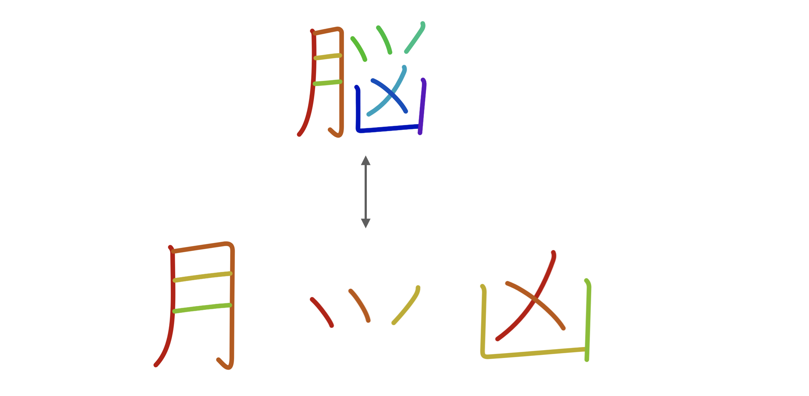

# kanjivg-radical



## Usage
Before using kanjivg-radical, import each json files as dictionaries as following code.


```py
import json

def load_json(filename):
    with open(filename) as f:
        d = json.load(f)
    return d

kanji2element = load_json("../data/kanji2element.json")
element2kanji = load_json("../data/element2kanji.json")    
```

1. Kanji to radicals:

```py
In []: kanji2element["脳"]
Out[]: ['乂', '凶', '丿', '凵', '⺍', '月']
```

2. Radical to Kanjis:

```py
In []: element2kanji["月"]
Out[]: ['溯', '齟', '蔡', '羂', '肝', '育', '胆', '朦', '輸', '梢' ...]
```

For further detail, see `example/basic_usage.ipynb`

## How to make datasets from KanjiVG
Download kanjivg zip files from [GitHub release page](https://github.com/KanjiVG/kanjivg/releases) and extract in this repository's directory.

```sh
$ cd path/to/kanjivg-radical
$ wget https://github.com/KanjiVG/kanjivg/releases/download/r20160426/kanjivg-20160426-main.zip
$ unzip kanjivg-20160426-main.zip
```

And run a script as follows.

```sh
$ mkdir data
$ python src/extract_element.py
```

## License
This repository include [KanjiVG datasets](https://github.com/KanjiVG/kanjivg/blob/master/COPYING) and released under the Creative Commons Attribution-Share Aline 4.0 licence.
